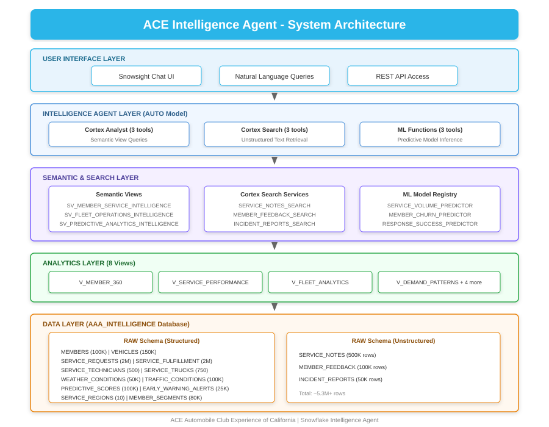
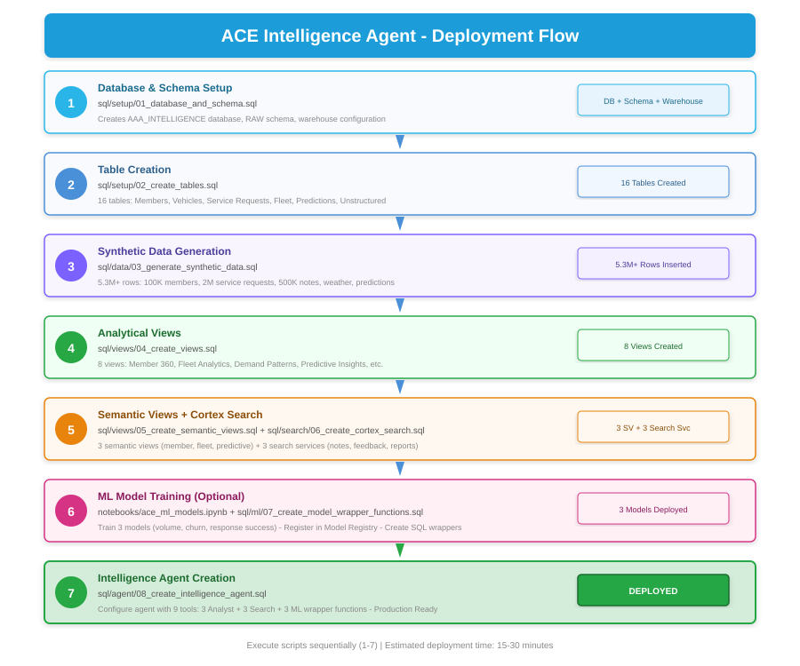
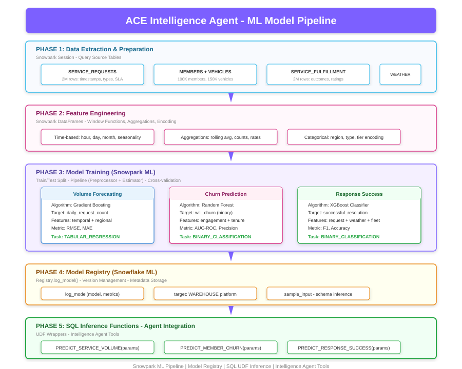
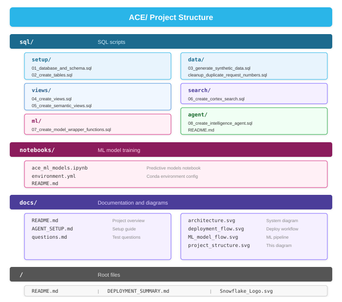

# ACE Intelligence Agent


A Snowflake Intelligence solution for ACE (Automobile Club Experience) California, providing AI-powered analytics for roadside assistance operations, member services, and fleet management.

## 🏗️ Architecture



## 🚀 Deployment Flow



## 🤖 ML Model Pipeline



## 🚗 Overview

The ACE Intelligence Agent leverages Snowflake's Cortex AI capabilities to provide natural language access to comprehensive roadside assistance data. Ask questions in plain English and get instant insights about operations, members, and predictive analytics.

## 🚀 Quick Start

```bash
# Execute SQL scripts in order:
1. sql/setup/01_database_and_schema.sql
2. sql/setup/02_create_tables.sql
3. sql/data/03_generate_synthetic_data.sql
4. sql/views/04_create_views.sql
5. sql/views/05_create_semantic_views.sql
6. sql/search/06_create_cortex_search.sql
7. sql/ml/07_create_model_wrapper_functions.sql
8. sql/agent/08_create_intelligence_agent.sql

# Optional: Run ML notebook to train predictive models
# notebooks/aaa_ml_models.ipynb
```

**Detailed setup instructions**: [docs/AGENT_SETUP.md](docs/AGENT_SETUP.md)

## 📊 Sample Questions

- "Which members are at high risk of breakdown in the next 30 days?"
- "What's our average response time for highway emergencies?"
- "Show me fleet utilization by region during peak hours"
- "Search service notes for common battery problems in cold weather"
- "What factors drive 5-star member satisfaction?"
- "Predict service volume for next quarter"
- "Which members are likely to cancel their membership?"

**Full question set**: [docs/questions.md](docs/questions.md)

## Project Structure



## ✅ Features

- **Natural Language Queries**: Ask questions in plain English
- **Predictive Analytics**: Breakdown risk, churn prediction, demand forecasting
- **Real-time Operations**: Fleet tracking, SLA monitoring, resource optimization
- **Semantic Search**: Search through 650K+ service notes, feedback, and reports
- **Multi-dimensional Analysis**: Analyze by region, time, service type, member segment
- **Machine Learning Models**: 
  - Service request volume forecasting
  - Member churn prediction
  - Response success prediction
- **Intelligent Agent**: AUTO model selection for optimal query performance

## 📈 Data Volumes

- 100,000 ACE members
- 150,000 vehicles
- 2,000,000 service requests
- 500 technicians
- 750 service trucks
- 500,000 service notes
- 100,000 member feedback entries
- 50,000 incident reports

## 🛠️ Technologies

- **Snowflake Cortex AI**: Natural language processing
- **Semantic Views**: Structured data intelligence
- **Cortex Search**: Unstructured text search
- **Model Registry**: ML model deployment and management
- **Snowpark ML**: Model training and pipeline creation
- **SQL**: Data modeling and analytics

## 📝 License

© 2025 ACE Automobile Club Experience of California. All rights reserved.

---

**Created**: October 2025  
**Version**: 1.0  
**Based on**: Snowflake Intelligence Template Pattern
